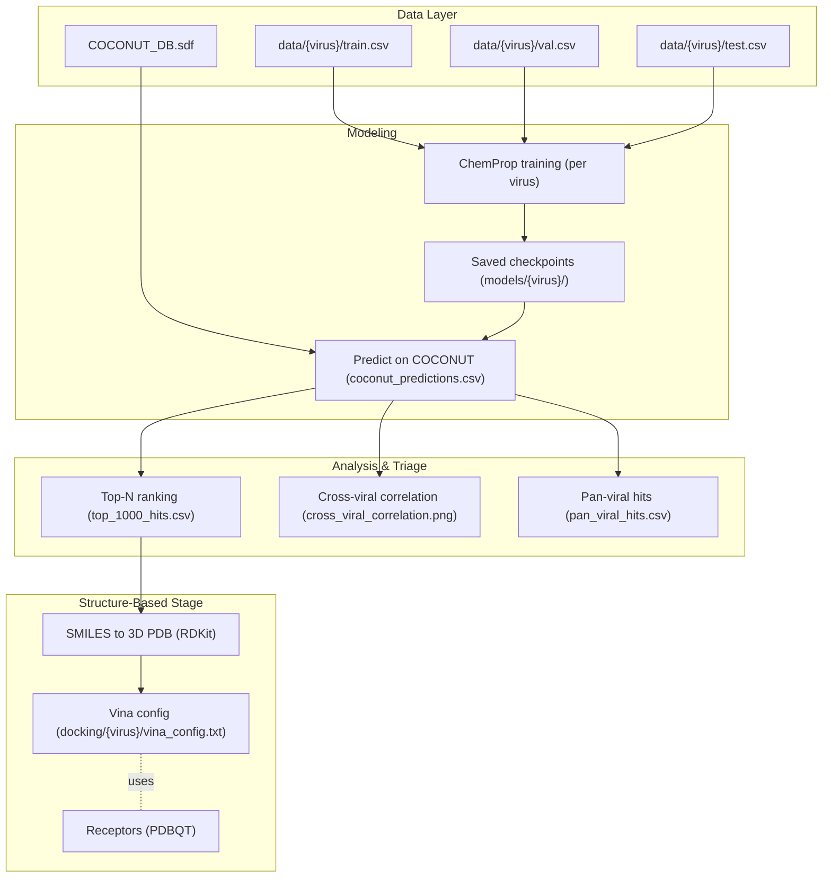

# Virus‑Specific Drug Discovery — Concept & Scientific Rationale

> A concept-first project that trains virus‑specific machine learning models on molecular activity, screens large natural‑product libraries, and prioritizes candidates for docking and follow‑up studies. This README focuses on **what** the system is and **why** it matters—not how to install or run it.

---

## What this project is

A modular pipeline for **AI‑assisted antiviral discovery**. It organizes curated activity data by virus, learns **structure–activity relationships** (SAR) with ChemProp message‑passing neural networks, and applies those models to **virtual screening** of the COCONUT natural‑products database. Top‑ranked candidates are **converted to 3D** for receptor‑guided **docking**, and predictions across viruses are fused to detect **cross‑viral and pan‑viral** signals.

**Core idea:** train **separate, virus‑specific classifiers** that capture the biochemical “fingerprint” of inhibition for each pathogen, then compare their predictions to illuminate **shared vulnerabilities** among distinct viruses (e.g., protease or polymerase inhibitor‑like patterns).

---

## Goals

- **Accelerate target‑guided discovery** by focusing ML models on virus‑specific activity landscapes.
- **Exploit chemical priors in natural products** (COCONUT) for scaffold novelty and ADMET‑friendly bias.
- **Reduce false positives** via multi‑stage evidence: ML scoring → cross‑viral consistency → docking plausibility.
- **Surface pan‑viral hypotheses** by analyzing cross‑model agreement at the compound level.
- **Stay reproducible** with clear data splits (train/val/test) and explicit artifacts (predictions, plots, top hits).

---

## What the pipeline does (high level)

1. **Data curation (per virus)** — CSVs of (`smiles`, `active`) with strict separation of splits to limit leakage.
2. **Modeling (ChemProp)** — Virus‑conditioned graph neural networks learn SAR and output activity scores.
3. **Library screening (COCONUT)** — Convert SDF → SMILES, predict activity per virus, and rank compounds.
4. **Docking prep** — Generate 3D ligand structures; provide a Vina config template for receptor docking.
5. **Cross‑viral analytics** — Correlate prediction vectors, tally multi‑virus actives, flag potential **pan‑viral** hits.
6. **Artifacts** — JSON metrics, ranked CSVs, and a correlation heatmap supporting downstream decisions.

---

## Architecture

---

## Scientific context (concise)

### Why virus‑specific models?
Antivirals often hinge on **target class–specific** features (e.g., proteases vs. polymerases). Pooling heterogeneous labels across viruses can blur those features. Building **per‑virus models** preserves the local SAR manifold and reduces label noise, improving precision for that pathogen’s biochemical space.

### Why natural products?
Natural products (NPs) capture **biosynthetic diversity** with unique stereochemistry and privileged scaffolds that can navigate protein pockets effectively. Screening COCONUT introduces a **chemically rich prior**, increasing the chance of finding **novel yet bindable** motifs while offering better “drug‑likeness” starting points for lead optimization.

### Why a multi‑stage funnel?
- **ML scoring** (fast) expands the search frontier from millions to thousands.
- **Cross‑viral concordance** highlights candidates that might engage **conserved mechanisms** (e.g., active‑site geometries or cofactor interactions).
- **Docking** provides a **structural plausibility check** (pose quality, interaction fingerprints). Together, these reduce false positives versus single‑stage screening.

### On evaluation
We emphasize **ROC‑AUC and PR‑AUC** for ranking quality, plus **sensitivity/specificity** to understand decision thresholds. To mitigate information leakage, splits are designed to reduce **scaffold overlap**, making reported metrics more realistic for prospective performance.

---

## What this project might enable

- **Rapid triage** of large NP libraries for specific viral targets.
- **Mechanistic hypotheses**: docking poses + cross‑virus signals suggest which protein sites are being mimicked.
- **Portfolio balance**: mix of virus‑specific hits and **pan‑viral** candidates for pandemic preparedness.
- **Downstream validation**: smooth handoff to MD simulations, MM/GBSA rescoring, and experimental design.

---

## Assumptions & boundaries

- **Label fidelity matters**: activity labels should reflect comparable assay conditions per virus/target.
- **Docking is supportive, not definitive**: pose plausibility ≠ confirmed binding; experimental follow‑up is essential.
- **Generalization is local**: models extrapolate poorly far from training chemistry; novelty checks are recommended.
- **Ethical scope**: intended strictly for therapeutic discovery and scientific research—not for misuse.

---

## Key artifacts produced

- `models/<virus>/…` — trained checkpoints and predictions
- `results/model_evaluation.json` — per‑virus metrics for transparency
- `results/<virus>/top_1000_hits.csv` — ranked screening hits
- `results/pan_viral_hits.csv` — cross‑virus consensus candidates
- `results/cross_viral_correlation.png` — interpretable cross‑signal map
- `docking/<virus>/*.pdb` & `vina_config.txt` — structure prep for receptor docking

---

## Roadmap (example)

- Add **assay‑aware reweighting** to harmonize cross‑dataset biases.
- Integrate **pose filtering** via interaction fingerprints (e.g., H‑bond/π‑stack counts vs. reference ligands).
- Add **uncertainty estimates** (ensembles/MC‑dropout) to de‑risk out‑of‑domain predictions.
- Expand to **polymerase/entry inhibitors** with target‑specific conditioning.
- Optional **active learning loop** with batch acquisition from wet‑lab feedback.

---

*This document intentionally omits installation and run commands to keep the focus on concept, goals, and scientific rationale.*
