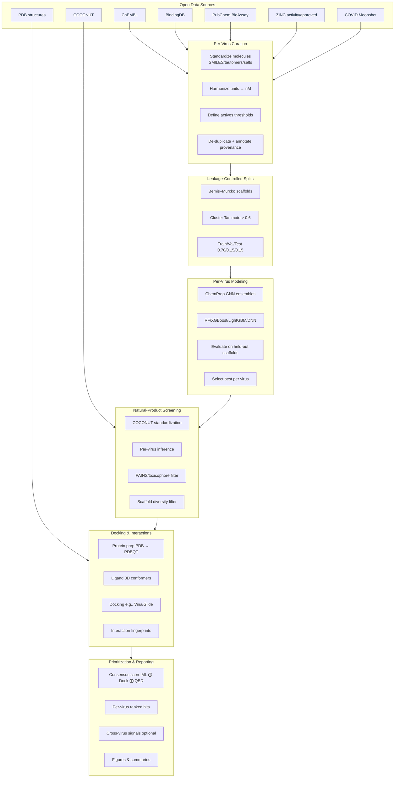
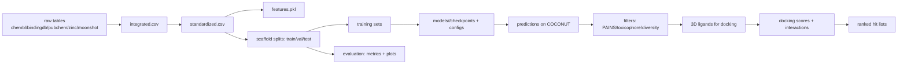

# AI-Driven Discovery of Natural-Product Inhibitors of Viral Proteases

**Repository purpose.** Companion code and artifacts for a study that (i) integrates multi-source bioactivity data per
virus, (ii) trains separate virus-specific models, (iii) screens the COCONUT natural-products library, and (iv) applies
docking as a structural plausibility check. This README summarizes the idea, data provenance, pipeline design, and
repository layout for readers of the paper.

---

## Summary

We curate per-virus activity datasets from ChEMBL, BindingDB, PubChem BioAssay, ZINC activity/approved subsets, and (for
SARS-CoV-2) COVID Moonshot; standardize molecules and labels; enforce scaffold-aware splits; train multiple model
families per virus (ChemProp GNNs and classical ML on fingerprints/descriptors); select the best model by pre-registered
metrics; screen COCONUT; filter hits by PAINS/toxicophores and scaffold diversity; and dock top candidates to
ligand-informed protease structures. All steps keep **strict per-virus isolation** to avoid label mixing and to reflect
realistic prospective performance.

---

## Scientific context

* **Targets covered (default testbed):** HIV-1 protease, HCV NS3/4A, SARS-CoV-2 Mpro, Dengue NS2B-NS3, Zika NS2B-NS3.
* **Rationale:** Viral proteases are validated antiviral targets with conserved catalytic motifs. Natural products
  contribute privileged, stereochemically rich scaffolds. Per-virus learning preserves local SAR and reduces label noise
  relative to pooled training.
* **Evaluation stance:** Scaffold-aware splits (Bemis–Murcko/clustered) approximate generalization to new chemotypes
  better than random splits; we report ROC-AUC and PR-AUC as primaries, with Balanced Accuracy, F1, MCC, and calibration
  as secondaries.

---

## Data provenance (what we integrate)

* **ChEMBL:** curated bioactivities (IC₅₀/Kᵢ/Kd/EC₅₀), relation-qualified; assay confidence recorded.
* **BindingDB:** protease binding/inhibition values.
* **PubChem BioAssay:** confirmatory antiviral/protease assays (binary activity).
* **ZINC activity/approved subsets:** diverse positives/decoys where applicable.
* **COVID Moonshot (SARS-CoV-2 only):** medicinal-chemistry dataset for Mpro.
* **COCONUT:** natural-products screening library (>400k entries).
* **PDB:** ligand-bound protease structures for grid definition and interaction references.

**Standardization & fields.** Molecules are neutralized/canonicalized; salts/solvents removed; units harmonized to nM;
duplicates resolved (keep most potent or curated aggregation). Each record
retains `source`, `assay_id/target_id`, `measurement_type`, `relation`, `original_units`,
standardized `value_nM`, `label_active` (default threshold 1000 nM; relaxed to 5000 nM for sparse targets),
and `assay_type`.

---

## Method overview (at a glance)

1. **Per-virus curation & integration** (multi-source merge with full provenance).
2. **Standardization & features** (ECFP4/MACCS + physchem; graphs for GNNs).
3. **Scaffold-aware splits** (clustered Bemis–Murcko; zero scaffold overlap).
4. **Model pluralism per virus** (ChemProp ensembles + RF/XGBoost/LightGBM/DNN).
5. **Model selection per virus** (pre-declared metric on held-out scaffolds).
6. **COCONUT screening** (standardize → predict → PAINS/toxicophore → diversity).
7. **Docking plausibility** (protein prep, ligand 3D, docking, interaction fingerprints).
8. **Prioritization** (consensus of ML probability, docking score, simple drug-likeness).

---

## Repository structure (what lives where)

```
viral-protease-discovery/
│
├── setup/                 # dependency manifests, environment checks
├── data_collection/       # downloaders (ChEMBL/BindingDB/PubChem/ZINC/Moonshot) + integration
├── data_processing/       # standardization, features, scaffold-aware splits
├── model_training/        # ChemProp, RF, XGBoost, LightGBM, DNN (per-virus scripts)
├── model_evaluation/      # metrics, selection, reporting
├── screening/             # COCONUT download/prep, inference, filtering
├── docking/               # protein/ligand prep, docking, interaction analysis
├── analysis/              # cross-virus aggregation, prioritization, final report
├── data/
│   ├── activity/{virus}/{raw,processed,splits}/
│   ├── natural/coconut/
│   ├── models/{virus}/{algo}/
│   └── results/{screening,docking}/
├── configs/               # targets, model, docking YAMLs
├── utils/                 # shared helpers (chemistry, IO, visualization)
├── logs/                  # structured logs
├── notebooks/             # optional exploratory analyses
└── requirements.txt
```

---

## Architecture diagrams

### System flow (sources → curation → models → screening → docking → prioritization)



### Data lifecycle (per virus)



---

## Evaluation reporting (what to expect)

* **Primary metrics:** ROC-AUC and PR-AUC on **held-out scaffolds**.
* **Secondary:** Balanced Accuracy, F1, MCC, calibration curves.
* **Leakage control:** explicit evidence of zero scaffold overlap across splits; scaffold-retention vs random-split
  comparisons.
* **Artifacts:** metrics JSON, plots (ROC/PR, calibration, confusion matrices), ranked screening CSVs, docking
  summaries.

---

## Limitations (interpretation)

* Assay heterogeneity and publication bias can affect labels and thresholds.
* Docking provides **plausibility**, not confirmation; experimental validation is required.
* Sparse targets (Dengue/Zika) may need relaxed activity thresholds and class balancing; uncertainty estimates are
  recommended.

---

## Ethics and intended use

For therapeutic discovery and academic research. Not intended for misuse. Predictions are hypotheses that must be
validated experimentally (enzymatic and cellular assays).

---

## Citation

Please cite the accompanying paper and acknowledge data providers: **ChEMBL**, **BindingDB**, **PubChem**, **ZINC**, *
*COVID Moonshot**, **COCONUT**, and PDB entries used for docking. Include licenses/terms as indicated in `NOTICE.md`.

---

## Acknowledgments

Thanks to the maintainers of the above open databases and to contributors who improved data curation, modeling, and
docking workflows.

---

## Contact

For questions about data integration, modeling choices, or to report issues, please open a GitHub Issue or contact the
corresponding author listed in the paper.
